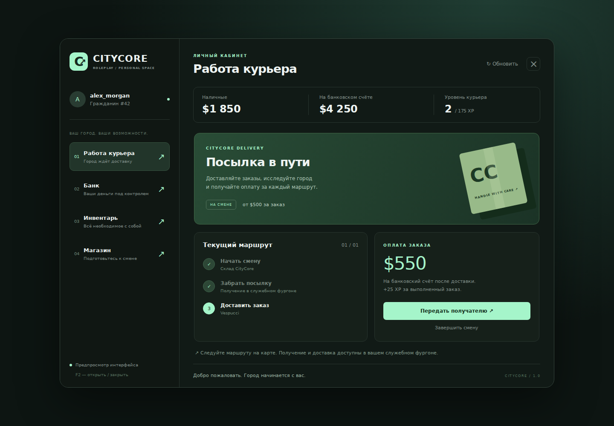

# CityCore RP — портфолио разработчика RAGE MP

Самостоятельный демонстрационный проект для вакансии JavaScript / TypeScript разработчика RP-систем. Не является продуктом Majestic и не использует их код или брендовые материалы.

**Стек:** TypeScript, Node.js 22+, NestJS, RAGE MP, MariaDB 10.11+, Knex, mysql2, Vue 3, Redis (опционально), Docker Compose.



## Что реализовано

- Регистрация и вход: scrypt, случайная соль, хеш сессионного токена в БД; один персонаж на аккаунт.
- Курьер: смена, служебный Speedo, заказ, получение посылки, маршрут, доставка, банковская зарплата, XP и уровень, следующий заказ, отмена при выходе или потере машины.
- Банк: наличные и счёт, пополнение, снятие, переводы по постоянному ID персонажа, история операций.
- Инвентарь: слоты, вес, стопки, покупка/продажа, передача рядом стоящему игроку, еда и аптечка, журнал предметов.
- Серверная проверка полей, расположения, измерения мира, состояния заказа и принадлежности транспорта.
- Транзакции InnoDB, последовательные блокировки персонажей, идемпотентность запросов, ограничение частоты действий.
- Приватный административный API NestJS: обзор экономики и журнал одного персонажа.
- Vue CEF UI, сборка пакетов RAGE MP, установщик с резервными копиями, тесты и CI.

См. [отчёт проверки](docs/VERIFICATION.md) — там отдельно указаны автоматические проверки и шаги, которые требуют запуска GTA V. Это версия для локального портфолио и доработки, а не проверенный на большом онлайне игровой сервер.

## Быстрый старт на Windows с уже установленной MariaDB

### 1. Подготовь программы

Нужны Node.js **22 или новее**, MariaDB **10.11 или новее**, VS Code, GTA V и совместимый клиент RAGE MP. Серверные файлы RAGE MP получают отдельно через официальный клиент; они не включены в архив.

Официальная инструкция получения серверных файлов: <https://wiki.rage.mp/wiki/Getting_Started_with_Server>.

### 2. Распакуй и открой проект

Рекомендуемый путь: `C:\Projects\citycore-rp`. Открой эту папку через **File → Open Folder** в VS Code. Затем **Terminal → New Terminal**.

Проверка программ:

```powershell
node -v
npm -v
```

Если PowerShell блокирует `npm.ps1`, выбери терминал **Command Prompt** в VS Code или используй `npm.cmd` вместо `npm`.

Установка:

```powershell
npm ci
npm run setup
```

`setup` создаёт `.env` и `ragemp/server-config.json`. Это настоящие конфигурации с автоматически созданными ключами. Повторный запуск сохраняет существующие файлы.

### 3. Создай отдельную базу и пользователя

Открой HeidiSQL или MariaDB Client под администратором. Выполни SQL, **заменив `YOUR_LOCAL_PASSWORD` своим паролем для нового пользователя**:

```sql
CREATE DATABASE citycore CHARACTER SET utf8mb4 COLLATE utf8mb4_unicode_ci;
CREATE DATABASE citycore_test CHARACTER SET utf8mb4 COLLATE utf8mb4_unicode_ci;
CREATE USER 'citycore'@'127.0.0.1' IDENTIFIED BY 'YOUR_LOCAL_PASSWORD';
GRANT ALL PRIVILEGES ON citycore.* TO 'citycore'@'127.0.0.1';
GRANT ALL PRIVILEGES ON citycore_test.* TO 'citycore'@'127.0.0.1';
```

Для существующих баз/пользователя этот шаг не повторяй. Тестовая база нужна для автоматических проверок; приложение использует `citycore`.

### 4. Укажи параметры подключения

В `.env` измени только параметры MariaDB под свою установку:

```dotenv
DB_HOST=127.0.0.1
DB_PORT=3306
DB_NAME=citycore
DB_USER=citycore
DB_PASSWORD=YOUR_LOCAL_PASSWORD
TEST_DB_NAME=citycore_test
```

`3306` — стандартный порт; используй свой, если MariaDB настроена иначе. `DB_ROOT_PASSWORD` нужен только для варианта Docker. Оставь сгенерированные `BRIDGE_KEY` и `ADMIN_KEY`: скрипт уже связал ключ сервера с `ragemp/server-config.json`.

Если вручную меняешь `BRIDGE_KEY` или `API_PORT`, обнови соответствующие значения и в `ragemp/server-config.json`, затем повтори установку пакетов в RAGE MP.

### 5. Собери и запусти ядро

```powershell
npm run build
npm run db:migrate
npm test
npm run test:integration
npm start
```

Последняя команда остаётся работать. Открой `http://127.0.0.1:3100/health` в браузере: ожидается `{"ok":true,"project":"CityCore RP"}`.

Выполнять миграции нужно до первого запуска API. Они создают таблицы; повторный запуск не стирает данные. Если начальная миграция прервана, см. `docs/OPERATIONS.md`: DDL MariaDB не откатывается целиком.

### 6. Подключи игровые пакеты

Во **втором** терминале VS Code, из папки проекта:

```powershell
npm run install:rage -- "C:\RAGEMP\server_files"
```

Замени путь на свою папку, где находится `ragemp-server.exe`. Установщик:

1. копирует `packages/citycore` и `client_packages/citycore`;
2. кладёт секретную конфигурацию только в серверный `packages/citycore`;
3. добавляет загрузку клиента в `client_packages/index.js`;
4. делает резервные копии заменяемых модулей;
5. создаёт `conf.json`, только если его ещё нет.

Существующий `conf.json` сохраняется. В нём должно быть `"enable-nodejs": true`. Для начала используй отдельную чистую папку сервера, чтобы чужие игровые ресурсы не меняли спавн, транспорт и CEF.

Запусти `ragemp-server.exe`. В консоли ожидается `[citycore] RAGE adapter ready`. В RAGE MP подключись напрямую к `127.0.0.1:22005`.

### 7. Пройди игровой сценарий

- Создай аккаунт: 3–24 латинских символа/цифры/подчёркивания, первый символ — буква; пароль — от 10 символов.
- Войди. Персонаж появляется у склада; стартовый баланс — $1000 наличными.
- **F2** открывает и закрывает меню. **Esc** закрывает его после входа.
- В разделе работы нажми **Начать смену**: появится фургон. Внутри фургона у склада нажми **Получить посылку**.
- Закрой меню, доедь до точки по маршруту, открой F2 и нажми **Передать получателю**. Заказ проверяет точку и минимальное время доставки.
- Деньги поступят на счёт. Вернись на склад для следующего заказа либо закончи смену.
- У банка можно снять зарплату; у магазина — купить воду, еду или аптечку.
- Для передачи вещей второй игрок должен стоять рядом. Используй **ID персонажа из меню**, а не временный ID соединения RAGE MP. Банковский перевод допускает офлайн-получателя.
- Перезайди: баланс, XP и предметы сохранятся; незавершённая смена отменится.

## Если хочешь MariaDB через Docker

Этот вариант заменяет шаги 3–4, когда отдельной MariaDB ещё нет. После `npm ci` и `npm run setup` оставь `DB_PORT=3307` из сгенерированного `.env`:

```powershell
docker compose up -d mariadb
docker compose ps
npm run build
npm run db:migrate
npm start
```

Дождись статуса `healthy` у БД. Docker создаёт `citycore`, `citycore_test` и пользователя с паролем из `.env`. Порт 3307 помогает не конфликтовать с обычной локальной MariaDB на 3306.

Для контейнерного API вместо `npm start`:

```powershell
docker compose --profile backend up -d --build
```

API по-прежнему доступен локально на 3100. Не запускай одновременно контейнерный API и `npm start` на одном порту. Игра работает отдельным процессом на том же компьютере.

Redis для локального Node API:

```powershell
docker compose --profile extras up -d redis
```

После этого задай `REDIS_URL=redis://127.0.0.1:6379` в `.env` и перезапусти API. Без Redis работает ограничитель для одного процесса в памяти. Контейнерный профиль API намеренно использует локальный ограничитель; подключение его к сервису Redis описано в `docs/OPERATIONS.md`.

## Полезные команды

| Команда | Назначение |
|---|---|
| `npm run build` | TypeScript, RAGE server/client, Vue CEF |
| `npm run db:migrate` | Создание/обновление таблиц |
| `npm test` | Проверки валидации без БД |
| `npm run test:integration` | Транзакции и HTTP на `TEST_DB_NAME` |
| `npm run bench` | Локальный тест операций экономики; обновляет `docs/benchmark.json` |
| `npm run dev:ui` | Просмотр меню в браузере с явно обозначенными демо-данными |
| `node scripts/admin.mjs` | Приватный обзор экономики |
| `node scripts/admin.mjs 42` | Состояние и журналы персонажа #42 |

Предпросмотр UI не выполняет игровые действия и не имитирует сервер. Рабочие действия доступны в CEF внутри RAGE MP.

## Как устроены папки

| Папка | Содержимое |
|---|---|
| `src/core` | Правила экономики, инвентаря, курьера, авторизация |
| `src/infra` | MariaDB, миграции, ограничение запросов |
| `src/api` | Тонкие NestJS-контроллеры и обработка ошибок |
| `shared` | Контракты, предметы, координаты, игровые ограничения |
| `ragemp/server` | Серверный адаптер: игроки, машины, события, HTTP к ядру |
| `ragemp/client` | Клиент RAGE: CEF, клавиши, маршрут, маркеры |
| `ui` | Vue-интерфейс |
| `tests` | Unit и интеграционные тесты |
| `release/ragemp` | Собранные игровые пакеты без секретов |
| `docs` | Архитектура, проверки, эксплуатация и сценарий портфолио |

Продолжение: [архитектура](docs/ARCHITECTURE.md), [демонстрация](docs/PORTFOLIO.md), [запуск и диагностика](docs/OPERATIONS.md).
