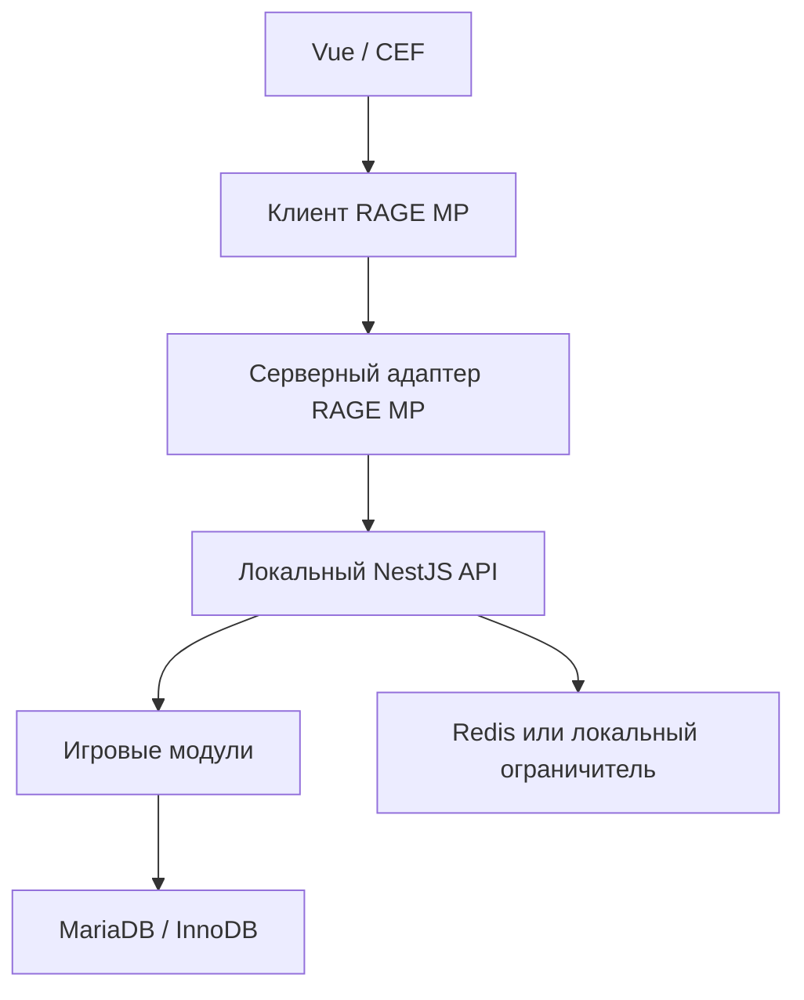
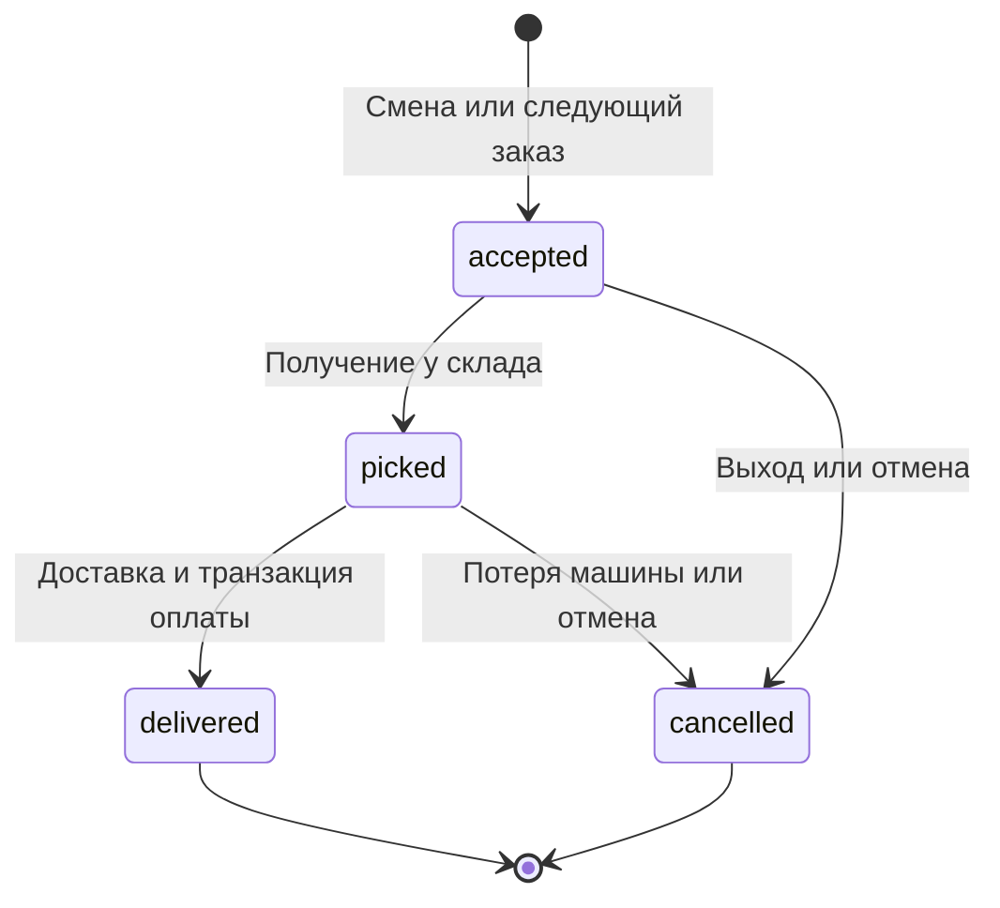

# Архитектура и инженерные решения

## Границы доверия

Клиент выбирает действие и передаёт его параметры. Он не выбирает персонажа-отправителя, цену, зарплату, XP или координаты для проверки. Сервер RAGE хранит токен сессии и получает позицию, dimension, здоровье и транспорт из серверного API; NestJS принимает этот контекст только с приватным `x-bridge-key`. Получатель передачи предметов определяется по серверной карте активных персонажей.

Значения GTA всё равно зависят от сетевой синхронизации игры. Проверка точки и времени не является полной защитой от телепорта/читов. Античит, проверка траектории и выявление подозрительных перемещений — отдельный слой.

## Почему ядро отдельным процессом

Встроенный Node в выбранной сборке RAGE может отличаться от современного системного Node. Адаптер собирается в CommonJS с target Node 12, использует только встроенные http/fs/path/crypto; NestJS, Knex и mysql2 работают в системном Node 22+. Это также позволяет тестировать логику без GTA.

Цена решения — дополнительный локальный HTTP-запрос для операции. В ядро не отправляются события каждого кадра или постоянные координатные потоки; только взаимодействия с игровыми системами. Запросы имеют таймаут, ограничения размера и частоты. Для крупного проекта границу можно заменить прямым вызовом или другим транспортом после замеров.

## Транзакции

Каждая мутация:

1. Валидирует тип и поля действия строгой схемой.
2. Блокирует строки участвующих персонажей `SELECT ... FOR UPDATE` по возрастанию ID.
3. Проверяет запись `operations(character_id, request_id)`.
4. Проверяет бизнес-условия и изменяет кошелёк/предметы/заказ.
5. Записывает финансовый и/или предметный журнал и результат операции.
6. Выполняет commit. Любая ошибка откатывает все изменения DML.

При переводе обе стороны блокируются до списания; порядок фиксирован, поэтому встречные переводы не создают цикл AB/BA. При передаче предметов блокировка персонажа защищает не только конкретную стопку, но и общий вес/свободные слоты.

Деньги представлены целым количеством игровых долларов. Дробные суммы отвергаются. Лимит каждого кошелька — 1 млрд; DB CHECK дополнительно запрещает отрицательный или слишком большой баланс. Максимальная сумма одного пользовательского действия — 1 млн.

## Повторные запросы

Один UUID используется до получения определённого результата. Повтор с теми же параметрами возвращает сохранённую квитанцию, не выполняя действие повторно. Повтор с тем же UUID и другими параметрами отклоняется. У успешного заказа дополнительно изменяется состояние и очищается active_order: новый UUID также не позволяет повторно получить оплату за уже доставленную посылку.

Таймаут HTTP не доказывает, что операция не выполнилась. Поэтому интерфейс предлагает повторить последнее действие с тем же UUID. Между перезагрузками CEF этот UUID не сохраняется: после перезахода нужно сначала проверить состояние/историю, не создавать вслепую повторный перевод. Durable pending intents — возможное развитие.

## Жизненный цикл заказа

Смена остаётся активной после успешного заказа. Следующий берётся у склада в своём транспорте. Заказ живёт 30 минут. Получение/доставка доступны в своём фургоне. При истёкшем заказе нужно завершить смену. Повторный вход отменяет незавершённую работу, поскольку игровые машины не сохраняются в БД.

## Авторизация

Пароли хешируются scrypt со случайной солью; пароль не хранится в исходном виде. В БД хранится SHA-256 случайного 256-битного сессионного токена. Сессия живёт 24 часа. Новый вход заменяет предыдущую сессию и закрывает прежнее игровое соединение через адаптер. Это учебный single-character login, без восстановления пароля, почты и 2FA.

`BRIDGE_KEY` и `ADMIN_KEY` различаются. Административные методы доступны только для чтения. API слушает localhost, Docker публикует порт только на 127.0.0.1. Токен игрока и ключи никогда не отправляются в CEF. При переносе сервисов на разные машины нужен защищённый транспорт; текущий адаптер принимает только loopback HTTP URL.

## Ограничения версии

- Нет испытания с реальными игроками внутри GTA V в среде подготовки; координаты, камера/CEF, посадка и поведение смерти требуют игрового прогона.
- Приватный API рассчитан на один доверенный адаптер/один игровой сервер. Совместное владение сессиями несколькими серверами не реализовано.
- Регистрация даёт $1000: это demo-grant, не законченная экономическая политика против мультиаккаунтов.
- Инвентарь хранит одну стопку на тип предмета, фиксированный слот назначается автоматически. Перетаскивания и нескольких стопок одного типа нет.
- Посылка — состояние заказа, не переносимый физический предмет. Набор инструментов пока является торговым предметом без действия ремонта.
- Применение аптечки к здоровью GTA — внешний эффект после commit БД с семантикой «не повторять». При падении адаптера/потере ответа между commit и лечением аптечка может быть потрачена без эффекта. Для строгого восстановления нужен подтверждаемый журнал игровых эффектов; бухгалтерия денег и предметов остаётся транзакционной.
- Машина выдаётся после commit смены; при ошибке выдачи выполняется отмена. Падение между этими шагами исправляется повторным входом или периодической проверкой адаптера.
- Минимальное время доставки и дистанция — базовые проверки, не полноценный античит.
- Журналы/квитанции не очищаются автоматически; политика хранения нужна перед длительной эксплуатацией.
- RabbitMQ не добавлен: надёжный фоновый поток событий стоит внедрять с конкретным потребителем и transactional outbox. Redis уже имеет реальную роль ограничителя запросов.

## Первичные источники

- RAGE MP: <https://wiki.rage.mp/wiki/Getting_Started_with_Development>
- События: <https://wiki.rage.mp/wiki/Events::callRemote>
- Запуск сервера: <https://wiki.rage.mp/wiki/Getting_Started_with_Server>
- Транзакции Knex: <https://knexjs.org/guide/transactions.html>
- NestJS: <https://docs.nestjs.com/first-steps>
- MariaDB: <https://mariadb.com/docs/server>
